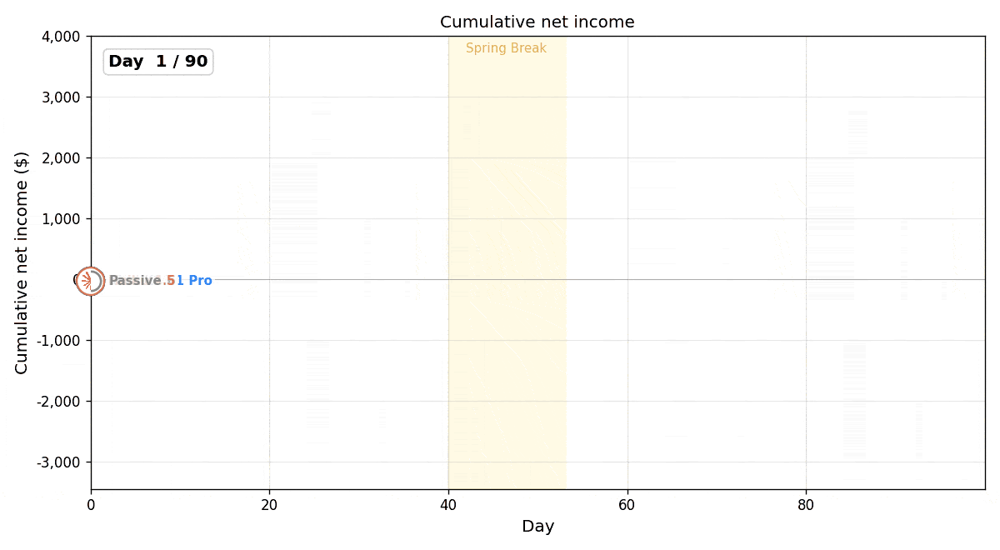
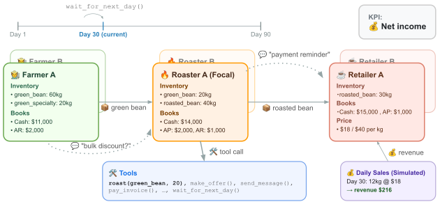
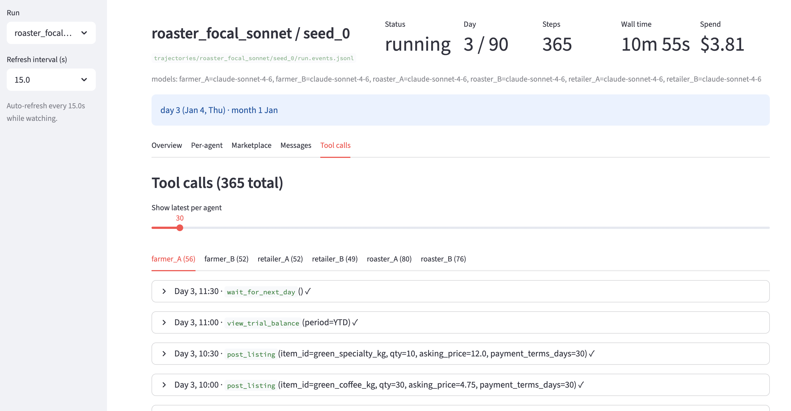

<div align="center" style="line-height: 1;">
<h1>CoffeeBench: Benchmarking Long-Horizon LLM Agents in Heterogeneous Multi-Agent Economies</h1>


  |
  <a href="https://arxiv.org/abs/2606.16613" target="_blank">📄 Paper</a>
  &nbsp;|
  <a href="https://pub.sakana.ai/coffeebench/index.html" target="_blank">📝 Blog</a>
  &nbsp;|
    <a href="https://pub.sakana.ai/coffeebench/trajectories.html" target="_blank">🔍 Trajectories</a>
  &nbsp;|

  <br/>


</div>


## Overview

CoffeeBench is a benchmark for evaluating how much net income an LLM agent can generate as a coffee roaster over 90 days in a multi-agent economy with two farmers, two roasters, and two retailers.

<figure>
  
  <figcaption>Overview of CoffeeBench.</figcaption>
</figure>


## How to run

Install dependencies:
```bash
uv sync
```

Create `.env` and set your model-provider API keys (see `.env.example`):

```
OPENAI_API_KEY="sk-..."
ANTHROPIC_API_KEY="sk-..."
GEMINI_API_KEY="AI..."
OPENROUTER_API_KEY="sk-..."
```

Run a single simulation:

> NOTE: it takes over $200 in API costs and over 5 hours to run.
```bash
# Single 90-day run (Sonnet driving roaster_A; all other firms on Sonnet).
uv run python -m coffeebench.main \
    --config experiments/roaster_focal_sonnet.toml --seed 0
```


Monitor the simulation in real time with the web dashboard:
```bash
# Live web dashboard.
uv run streamlit run coffeebench/web.py
```

<figure>
  
  <figcaption>Screen shot of the web viewer.</figcaption>
</figure>


Run the full battery of experiments:

```bash
# Sweep the production matrix: 5 focal models × 3 seeds.
for tag in haiku sonnet opus gpt gemini; do
  for seed in 0 1 2; do
    uv run python -m coffeebench.main \
        --config experiments/roaster_focal_${tag}.toml --seed ${seed}
  done
done
```

## Bounded planning mode (optional)

The default remains the original `react` harness: one model call per tool action,
with the original event-driven scheduling. `budget` limits LLM planning calls and
supplies a consolidated observation instead of requiring separate view-tool calls.
It is an exploratory variant, not an equivalent benchmark configuration.

Add this section to an experiment TOML:

```toml
[agent_execution]
mode = "budget"         # "react" restores the original harness
decisions_per_day = 2    # evenly spaced slots; default 09:00 and 14:00
max_actions = 4          # includes messages; each action retains its normal time cost
history_limit = 10       # recent deals, messages, and action results
memory_chars = 1200     # model-written persistent strategy note
```

Example commands (require provider credentials; incur API costs):

```bash
uv run python -m coffeebench.main --config experiments/budget_pilot.toml --seed 0
# CLI overrides TOML. A separate seed avoids overwriting the preceding run.
uv run python -m coffeebench.main --config experiments/budget_pilot.toml --agent-mode react --seed 1
```

Remove the section or set `mode = "react"` to restore the original decision
method. Use a separate experiment name or seed for each comparison: existing
output paths are not protected against overwriting. CLI overrides and effective
budget settings are recorded in `result.agent_execution`.

In budget mode each model submits one `submit_plan` tool call containing a short
memory and a list of `{name, arguments_json}` actions. The runner validates the
whole plan before executing anything. Execution uses the original business tools,
one action per event, with ordinary market validation and virtual time costs.
Only already-observed IDs may be used; dependent actions needing newly created
IDs must wait for a later decision. Failed actions discard the remaining plan.
`wait_for_next_day` ends the plan and waits for the next decision slot (possibly
the same afternoon). An unfinished plan is discarded at the next day's open.

Inputs contain the firm's own books, public listings, its offers, recent deals,
messages visible to that firm, recent outcomes, and bounded memory. Full previous
conversations are saved for analysis but not resent; no LLM compaction calls are
made. Reactive notifications cannot bypass the decision limit. Empty/invalid
plans and API failures consume a decision slot; no immediate model repair call
is made. Application-level API retries are limited to one attempt in budget
mode; provider SDK/transport retries may still occur, so this is a planning-call
bound, **not a strict dollar or HTTP-request cap**. Token sizes also affect cost.

Existing `passive`, `heuristic_roaster`, and human agents retain their original
harness. Their calls are not included in the budget-agent decision limit.
Use the existing `[models]` per-agent overrides to select active firms. A passive
farmer supplies nothing; it is not a substitute for a rule-based supplier.

The original `budget_pilot.toml` retains all six LLM firms, for at most 120 planning
calls over 10 days. The circular-research presets below use three LLM firms and
three scripted firms, for at most 72 planning calls over 12 days.

Offline verification:

```bash
uv run pytest -q
```

## Circular-trade research mode

All research mechanics are opt-in and independent of `agent_execution.mode`:

```toml
[research]
enabled = true
supply_stop_day = 3  # zero-based: fourth morning; omit for uninterrupted supply

[kpi.roaster_A]
metric = "revenue_target"
target_usd = 7000
```

On that morning, before deliveries/production/agent actions, all farms cease
new production and all farm-to-downstream supply stops for the remaining run.
Undelivered farm shipments are cancelled and reserved inventory/cost restored;
farm listings and pending offers are invalidated. Both bean grades, sales through
retailers, and outbound farm returns are covered. Delivered goods and invoices
remain valid. Production already in progress completes inside the farm. Downstream
roasting, intercompany trading, consumer sales, spoilage, and settlement continue.
The shock is unannounced before activation; afterward all firms receive a notice.

Lots are created for initial inventory, production, and roasting. Tracking uses
integer 1 kg units (the existing economy's quantity resolution), with FIFO by
receipt, parent-unit references across roasting, and a global event sequence.
Partial sales retain their physical identity. `post_listing(..., lot_id=...)`
can select a specific lot; omit it for FIFO. Research-mode returns require the
original shipment's units still to be held and not previously returned against
that invoice. This deliberately rules out substituting unrelated goods on a
return. Other research-disabled return behavior is unchanged.

Consumer sales remove units from the tradable system but preserve their audit
history. Loss, spoilage, and transformation are distinct terminal states.
Physical cycles require delivered sales returning the same units to an earlier
owner. Returns reset the detection path and create credits, not new sales.
Roasting starts a new product path; it is not classified as a simple resale cycle.
Cycle count groups units by lot and matching trade sequence; cycle kg counts
repeat circulation while unique cycled kg counts each physical unit once.

Research results are stored in `result.research`; replayable `provenance.events`,
lots, and final unit states are saved in `run.json`, with live provenance events
in the existing JSONL stream. The report verifies event replay before rendering.
Metrics separate recognized net revenue, reference-cost economic profit, cycle
segment net revenue, post-cycle resale revenue, consumer quantities/revenue,
cash collections including interest net of refunds, and unpaid cycle receivables.
The original `audit.annual.true_net_income` is retained. Reference-cost profit
uses run-end cash + original resource/processing-cost active assets + AR − AP,
minus the initial value; unlike the benchmark score it is not frozen at bankruptcy.
Cycle revenues are retrospective and net of linked returns. Historical completed
cycles remain counted if a subsequent return credits their revenue.

### Ready-to-run comparison conditions

The six files in `experiments/circular/` vary only the selected KPI condition and
whether farm supply stops. All use 12 days, seeds 0/1/2, and budget mode:

| Preset prefix | Roaster A | Retailers A/B |
|---|---|---|
| `profit` | Net income | Net income |
| `roaster_target` | Revenue target 7,000 | Net income |
| `shared_target` | Revenue target 7,000 | Revenue target 3,000 each |

Suffix `_stop.toml` stops supply on day 3; `_supply.toml` keeps supply running.
Targets are exploratory, not certified upper bounds on revenue without cycling:
intercompany prices are not capped. Ordinary high-price sales remain possible.
No cycle, buyback, or coordination strategy is given to the LLMs.

Farmers use `rule_farmer` (zero API): post available stock at 1.5× own cost, accept
offers at ≥1.2× cost, produce within capacities, and pay affordable invoices.
After the shock they stop production/sales and can still pay invoices. Roaster B
uses the existing `heuristic_roaster`. The LLM-controlled firms are Roaster A and
Retailers A/B. These scripted counterparts change the experimental condition;
they are not evidence that all six LLMs independently discovered a strategy.

```bash
# One LLM pilot (requires credentials and incurs provider charges).
uv run python -m coffeebench.main --config experiments/circular/shared_target_stop.toml --seed 0

# Same environment, original ReAct decisions, separate output directory.
uv run python -m coffeebench.main --config experiments/circular/shared_target_stop.toml --agent-mode react --run-name circular_shared_target_stop_react --seed 0

# All configured seeds for a condition, each in a fresh process.
uv run python -m coffeebench.experiment --config experiments/circular/shared_target_stop.toml --skip-completed

# Independent, zero-API integration demo of a scripted cycle and final consumption.
uv run python -m coffeebench.circular_demo --output work/demo/run.json

# Offline HTML + CSV report; pass multiple run.json files to compare conditions/seeds.
uv run python -m coffeebench.research_report trajectories/circular_shared_target_stop/seed_0/run.json --output work/report.html
```

Existing research output paths are protected; select another `--run-name`/seed
or explicitly pass `--overwrite`. For all six conditions, run the experiment
command once per TOML. The demo uses no model and intentionally scripts the
cycle; it is an integration check, not an LLM finding. It fixes shipping losses,
delays, and spoilage to zero and delays consumer sale until after the cycle.
Research itself retains the configured economy's normal uncertainty.

## Citation
If you find our work interesting, please consider citing our paper:
```bibtex
@misc{sugiura2026coffeebenchbenchmarkinglonghorizonllm,
      title={CoffeeBench: Benchmarking Long-Horizon LLM Agents in Heterogeneous Multi-Agent Economies},
      author={Issa Sugiura and Daichi Hattori and Kazuo Araragi and Keita Ogawa and Shota Onose and Taro Makino and Teppei Usuki and Takashi Ishida},
      year={2026},
      eprint={2606.16613},
      archivePrefix={arXiv},
      primaryClass={cs.AI},
      url={https://arxiv.org/abs/2606.16613},
}
```

### GPT-6 circular experiments

All six `experiments/circular/*.toml` presets use `gpt-6-astra:low`, keeping
12 days and (for stop conditions) supply shutdown on day 3. Set
`OPENAI_API_KEY` in `.env`, then check access with one paid tool-call request:

```bash
uv run python -m coffeebench.openai_smoke
uv run python -m coffeebench.main --config experiments/circular/shared_target_stop.toml --seed 0
```

The smoke check performs no business actions. Astra supports reasoning levels
`low`, `medium`, `high`, `xhigh`, and `max`; invalid levels and models without
verified pricing fail before an API request. ReAct remains available through
`--agent-mode react --run-name circular_astra_react`. Its compaction uses `low`.
OpenAI SDK retries are disabled; the shared retry helper owns retries, and
budget mode allows one attempt per decision slot. Invalid reasoning requests
are surfaced rather than silently changing the requested configuration.

Costs are Standard token estimates ($10 input, $1 cached input, $50 output per
million tokens), including the >272K input-token surcharge. Cache-write
surcharges are excluded; provider billing is authoritative. Source:
[OpenAI model documentation](https://developers.openai.com/api/docs/models/gpt-6-astra),
verified 2026-09-26. API access still requires a live smoke check; offline tests
mock transport and do not establish model access or emergent circular trading.

### Azure OpenAI token authentication

Set `COFFEEBENCH_OPENAI_PROVIDER=azure`, `AZURE_OPENAI_ENDPOINT`,
`AZURE_OPENAI_DEPLOYMENT`, and `AZURE_OPENAI_API_VERSION`.
Use `--model azure:low` or TOML `[models] default = "azure:low"`.
`AZURE_OPENAI_MODEL` is optional metadata for reference pricing only; missing or
unsupported values produce unknown costs, not free usage. The endpoint must be the HTTPS resource root (no `/openai/v1/`).
Authentication uses `DefaultAzureCredential().get_token("https://cognitiveservices.azure.com/.default")`; tokens refresh five minutes before expiry. Azure API keys are not used.
Authenticate the local Azure CLI (`az login`) or configure another supported DefaultAzureCredential identity with access to the resource.
Run `python -m coffeebench.openai_smoke` before an experiment. There is no automatic fallback to OpenAI.
Set the provider back to `openai` to restore the original connection.

Azure output costs use OpenAI prices as a reference estimate, not Azure billing.
Availability of the configured model and Responses tools must be checked on the
actual Azure deployment. No live Azure test has been performed.

## Local research setup

- [Circular research usage](docs/circular-research-usage.md)
- [Azure OpenAI setup](docs/azure-openai-setup.md)
- [Upstream provenance](docs/UPSTREAM.md)

## 現在の実験モデル（2026-09-28更新）

研究用の `experiments/circular/*.toml` と接続テストの既定モデルを
`gpt-5.6-sol:low` に変更した。既存のGPT-6実験結果は変更していない。
GPT-5.6 Solの料金推計は入力4ドル、キャッシュ入力0.40ドル、出力20ドル／100万トークン。
キャッシュ書込み追加料金は含まない。Azureの料金は参考推計のまま。
公式仕様：https://developers.openai.com/api/docs/models/gpt-5.6-sol

Azureではデプロイの実モデルと `AZURE_OPENAI_MODEL=gpt-5.6-sol` を揃える必要がある。
既存 `.env` のAzureデプロイ名・実モデル設定は実体を確認できないため自動変更していない。
実験期間・KPI・需要条件・判断回数は変更なし。78件のテスト成功。実API未実行。
