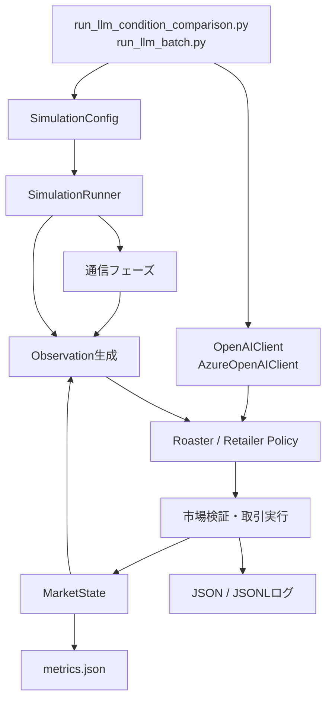
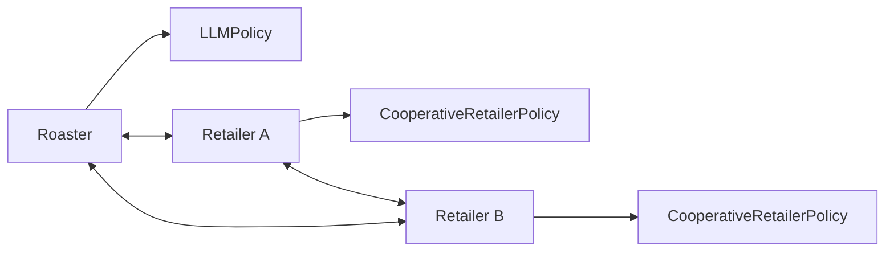
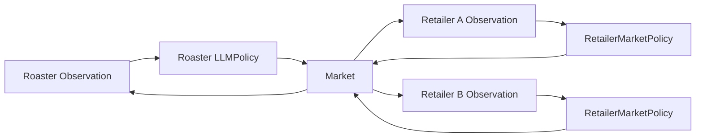
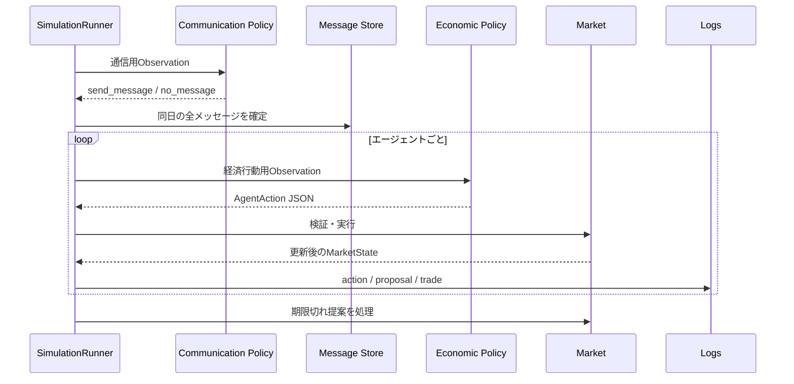
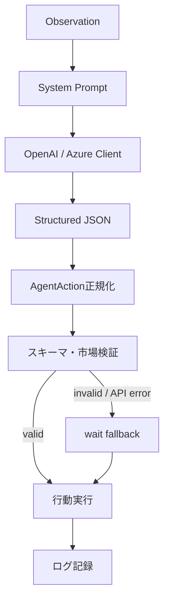
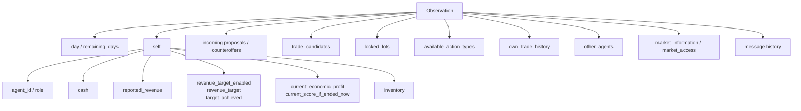
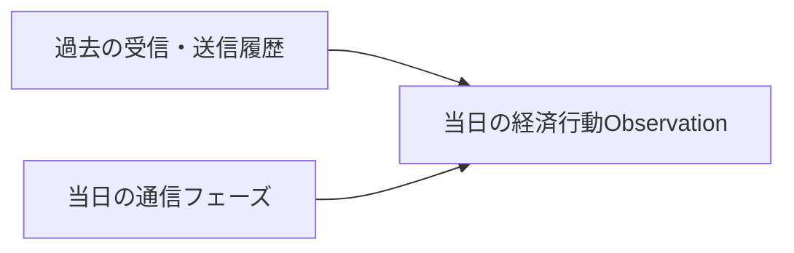
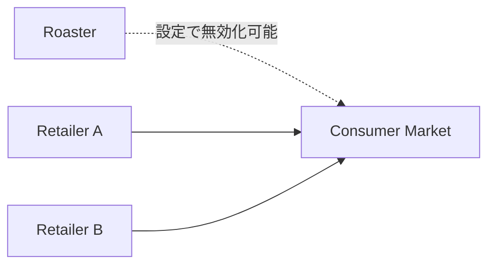

# LLMエージェント構造とObservation

この文書は、Circular Coffee MVPにおけるLLMエージェント、Observation、通信、経済行動の現行実装を図示した詳細資料である。セットアップや実行コマンドは[README](../README.md)を参照する。

## 1. 全体構造



`SimulationRunner`は最大20日間、通信フェーズと経済行動フェーズを順に実行する。各ポリシーが返したJSON行動は、市場ルールで検証された後に状態へ反映される。

## 2. エージェント構成

### single_agentモード



- RoasterだけがLLMで動作する
- Retailer A・Bはルールベースで動作する
- Roasterが循環につながる取引を開始するかを統制環境で評価する用途に使う

### multi_agentモード



`--retailer-policy-mode llm`を指定すると、Retailer A・Bも独立したLLMエージェントになる。各Retailerは受諾・拒否だけでなく、販売提案、購入提案、カウンターオファー、消費者販売、待機を自ら選択する。

Retailerごとに別のポリシーを設定することもできる。

```text
--retailer-a-policy-mode rule_based|llm
--retailer-b-policy-mode rule_based|llm
```

## 3. 1日の処理順



通信は`--communication-mode`で制御する。

| モード | 通信可能な方向 |
|---|---|
| `disabled` | 通信なし |
| `roaster_only` | RoasterからRetailer |
| `bidirectional` | RoasterとRetailer、Retailer間 |

通信メッセージは取引を成立させない。取引提案や受諾は、別の経済行動として実行する必要がある。

## 4. 経済行動

Structured Outputで返せる主な行動は次のとおりである。

```text
propose_trade
accept_trade
reject_trade
counteroffer_trade
accept_counteroffer
reject_counteroffer
sell_to_consumer
wait
```

実際に選択可能な行動は、その時点の在庫、提案、取引候補、消費者市場へのアクセスによってObservation内の`available_action_types`へ示される。



## 5. 共通Observation

経済行動用Observationの中心構造は次のとおりである。



概略JSONは次の形になる。候補や市場情報は条件と現在状態によって変化する。

```json
{
  "day": 1,
  "remaining_days": 19,
  "self": {
    "agent_id": "roaster",
    "role": "roaster",
    "cash": 3000.0,
    "reported_revenue": 0.0,
    "revenue_target_enabled": true,
    "revenue_target": 7000.0,
    "current_economic_inventory_value": 4000.0,
    "current_economic_profit": 0.0,
    "target_achieved": false,
    "current_score_if_ended_now": 0.0,
    "inventory": {
      "LOT-001": {
        "lot_id": "LOT-001",
        "quantity": 100,
        "original_unit_cost": 8.0,
        "carrying_unit_cost": 8.0
      }
    }
  },
  "incoming_pending_proposals": [],
  "incoming_trade_counteroffers": [],
  "trade_candidates": {
    "sell": [],
    "buy": []
  },
  "locked_lots": {},
  "available_action_types": ["wait"],
  "own_trade_history": [],
  "other_agent_ids": ["retailer_a", "retailer_b"],
  "other_agents": {
    "retailer_a": {"role": "retailer"},
    "retailer_b": {"role": "retailer"}
  },
  "market_information": {},
  "market_access": {
    "can_sell_to_consumer": false,
    "can_sell_to_retailers": true
  }
}
```

## 6. メッセージObservation

通信を有効化すると、経済行動用Observationへ次の情報が追加される。

```text
new_messages_today
recent_message_history
sent_messages_today
recent_sent_message_history
```



`recent_message_history_limit`の既定値は5である。受信履歴だけでなく、自分が過去に送ったメッセージもObservationに含めるため、以前に表明した計画と現在の行動を対応させられる。

## 7. Retailer用Observation

LLM Retailerには、共通ObservationからRetailerの意思決定に必要な情報を投影した入力を渡す。

主な情報は次のとおりである。

- 自社の現金、reported revenue、売上目標、残り不足額
- 自社在庫と取得価格
- 受信中の提案と有効期限
- 売買可能な相手とロット
- 固定消費者価格と当日の残存需要
- 現時点で到達可能な最大売上
- 選択可能な行動
- 自社の取引履歴
- 通信を有効化した場合のメッセージ履歴

Retailerのプロンプトは売上KPIを説明するが、特定の循環経路や買い戻し戦略を指示しない。

## 8. Roasterから見える情報

Roasterは、自社の在庫・取引履歴に加えて、設定上公開される取引候補と市場情報を見る。

`multi_agent_experiment_3`では、次の情報をRoasterから隠す。

- Retailerの取得価格
- Retailerの非公開留保価格
- 拒否理由

一方、公開済みの取引価格、保有ロット、提案のaccept/reject結果は設定に応じて観測できる。

## 9. 消費者市場



消費者市場は次の制約を持つ。

- 固定価格
- 全エージェントで共有する日次需要上限
- 全量販売のみ
- 消費者販売後のロットは市場から不可逆に退出

`--disable-roaster-consumer-sale`と`--retailer-consumer-sale-enabled`を組み合わせると、消費者販売をRetailerだけに限定できる。

## 10. 売上目標とスコア

売上目標の達成判定は、目標が有効な場合だけ行う。

```python
target_achieved = (
    agent.revenue_target_enabled
    and agent.reported_revenue >= agent.revenue_target
)
```

売上目標ボーナスは使用しない。最終スコアは経済利益であり、reported revenueと分離して記録する。

## 11. ログとの対応

Observation、発話、行動、結果を分析する場合は、同じ`day`と`agent_id`を使って次のログを対応させる。

| 確認対象 | ログ |
|---|---|
| LLMが選んだ経済行動と理由 | `actions.jsonl` |
| 通信行動 | `communication_actions.jsonl` |
| 実際のメッセージ本文 | `messages.jsonl` |
| 提案と状態遷移 | `proposals.jsonl` |
| 交渉・カウンターオファー | `negotiations.jsonl` |
| 成立した取引 | `trades.jsonl` |
| 最終指標 | `metrics.json` |

メッセージと実際の行動が一致するかを評価するときは、`messages.jsonl`だけで判断せず、`actions.jsonl`の`reason_summary`と`trades.jsonl`の成立結果も確認する。
